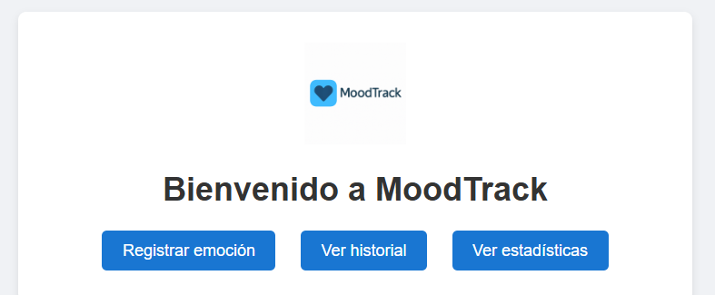
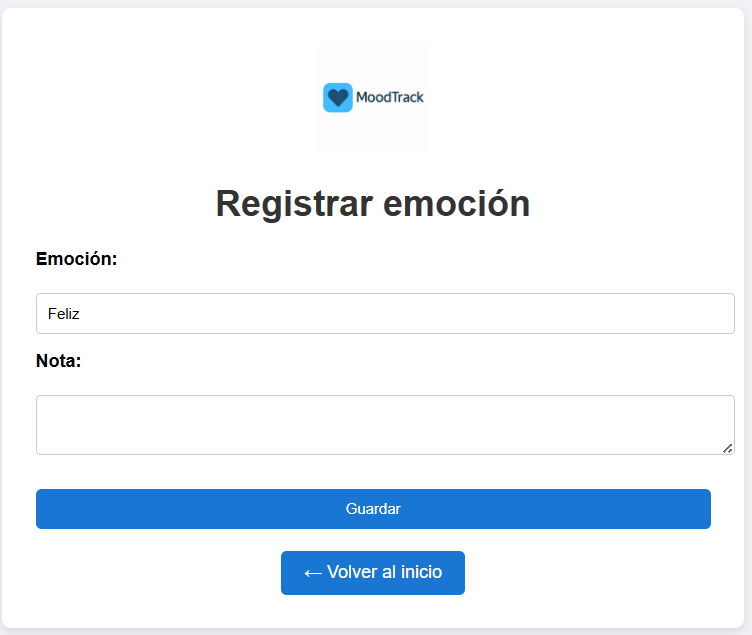
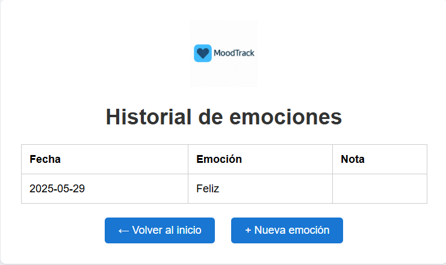
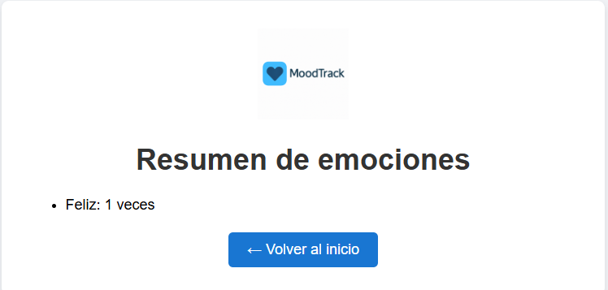

# MoodTrack 😄

Hola, soy **Santiago Lafuente Hernández** y este es mi proyecto intermodular de 1º de DAM.  
He creado **MoodTrack**, una aplicación web sencilla pero útil, pensada para registrar mis emociones del día, dejar notas personales, consultar el historial y ver un pequeño resumen gráfico.

Este proyecto está hecho paso a paso, sin complicaciones técnicas innecesarias, y con una estructura clara que he entendido y construido desde cero.

---

## 🚀 ¿Qué hace MoodTrack?

- Me permite **registrar cómo me siento** cada día con una palabra (alegre, triste, motivado, etc.)
- Puedo **añadir una nota opcional** explicando el motivo
- Veo un **historial completo** de mis emociones anteriores
- Y tengo una página de **estadísticas** con cuántas veces me he sentido de cada forma

---

## 🛠️ Tecnologías utilizadas

- **Java 17**
- **Spring Boot**
- **Thymeleaf** (motor de plantillas HTML)
- **H2 Database** (base de datos en memoria)
- **Gradle**
- **IntelliJ IDEA**
- **HTML + CSS**

---

## 🧱 Estructura del proyecto

Este proyecto está organizado de la siguiente manera:

```src/
└── main/
    ├── java/
    │   └── com.moodtrack.moodtrack/
    │       ├── MoodtrackApplication.java
    │       ├── controller/
    │       │   └── Web.java
    │       ├── model/
    │       │   └── MoodEntry.java
    │       └── repository/
    │           └── MoodEntryRepository.java
    └── resources/
        ├── templates/
        │   ├── index.html
        │   ├── form.html
        │   ├── list.html
        │   └── stats.html
        └── application.properties
```

---

## 🎨 Diseño visual

MoodTrack tiene un diseño **limpio y centrado**, con botones azules suaves y márgenes cómodos.  
El logo moderno que he elegido aparece en la cabecera de cada página y también como favicon en el navegador.

---

## 📸 Capturas

### Inicio:


### Registro de emoción:



### Historial:


### Estadísticas:



---

## 🧪 Cómo usarlo

1. Abre el proyecto con IntelliJ IDEA
2. Ejecuta la clase `MoodtrackApplication.java`
3. Abre tu navegador y entra en: `http://localhost:8080`
4. Disfruta de la experiencia registrando tus emociones

---

## ✅ Validaciones y facilidad de uso

Para mantenerlo simple, he usado validaciones básicas con `required` en HTML.  
Así me aseguro de que no se puede guardar una emoción vacía, sin complicar el codigo.

---


## ✍️ Autor

Desarrollado por **Santiago Lafuente Hernández**  
Estudiante de 1º de Desarrollo de Aplicaciones Multiplataforma  
Proyecto intermodular – Curso 2024/2025 - Aula Campus
